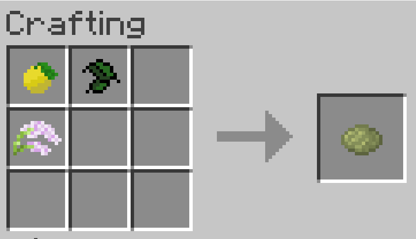
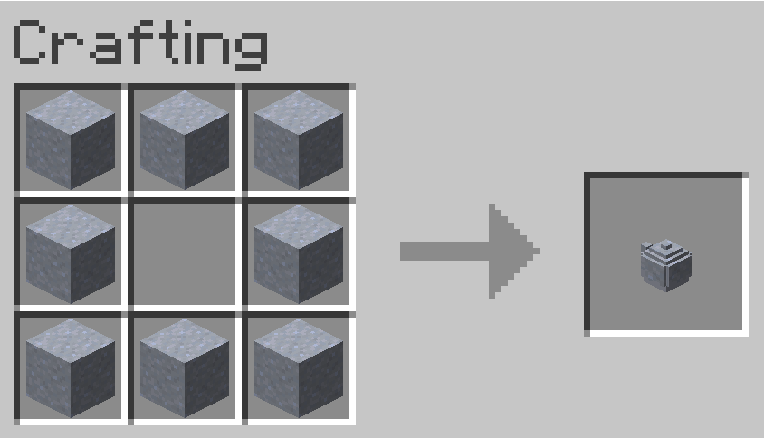
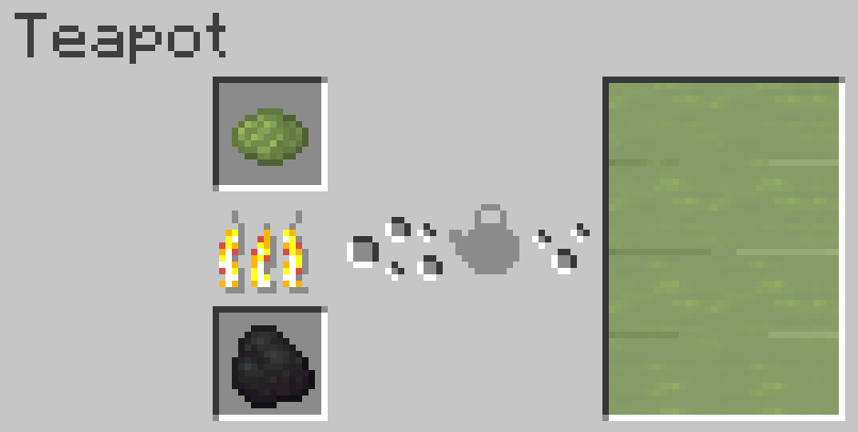
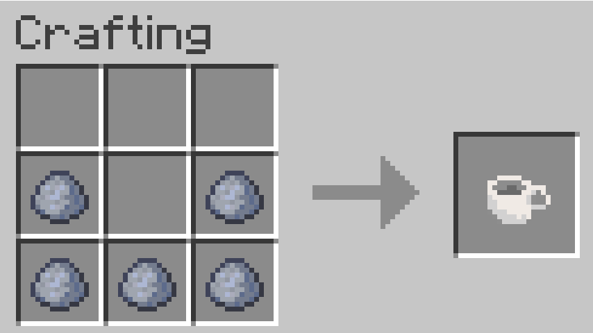

# Minesteeper

## About

Minesteeper is mod for Minecraft 1.20.2 that allows you to grow, craft, and brew your own custom teas in Minecraft. This mod is currently a work in progress, so expect changes!

## Getting Started

### Crops

Minesteeper currently adds 3 crops and 1 tree. These crops are:
* Tea leaves
* Mint
* Lavender

Seeds for new crops may be found by breaking grass, and can be grown in the same way as vanilla crops. Harvest these crops to get the raw ingredients to craft your teas. 

You may also rarely find bergamot trees within forest biomes. Their leaves may rarely drop bergamot oranges when broken.

### Crafting Teas

Crafting custom teas requires a tea base, and up to three other unique ingredients.

\

The tea bases that can be used are:
* Tea leaves
* Mint

Other ingredients are:
* Lavender
* Bergamot

These are only the currently added ingredients. Many more are planned to be added soon!

### Brewing Teas

Brewing teas requires the use of a teapot. An unfired teapot can be crafted using the recipe:

After crafting, the unfired teapot will need to be smelted in a furnace to be usable.

The teapot can then be used to brew your newly crafted loose leaf teas. Just place a loose leaf tea and fuel in the top and bottom slots respectively, and fill it with water using a bucket. If the fuel and tea is valid, it will begin to brew automatically. 

You can then remove your tea from the pot by clicking on the pot using a mug. Brewed tea gives different beneficial effects depending on the ingredients used. Experiment with different ingredients to see what effects they produce!

Milk and sugar can also be added to already brewed teas. Adding milk provides a curing affect, similar to drinking a bucket of milk, while adding a sugar cube will increase the strength of the effects given by the tea.

